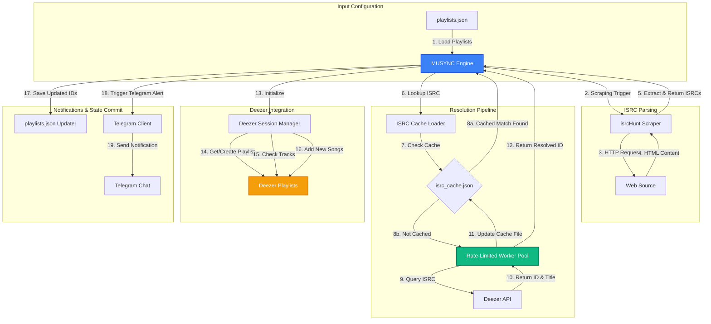

# MUSYNC

MUSYNC is a CLI tool written in Go that synchronizes music playlists to Deezer using ISRC (International Standard Recording Code) identifiers.

It runs as a single-pass command designed to be scheduled as a cron job or run in a GitHub Actions workflow.

## Features

- **ISRC Matching**: Resolves tracks by ISRC.
- **Rate Limiting**: Throttles requests to 9 requests per second.
- **Config Updates**: Updates playlist IDs in `playlists.json`.
- **ISRC Cache**: Caches resolved mappings in `isrc_cache.json`.
- **Telegram Notifications**: Sends run summaries.
- **GitHub Actions**: Runs sync on a cron schedule.

## System Architecture

The following diagram illustrates the execution flow:

