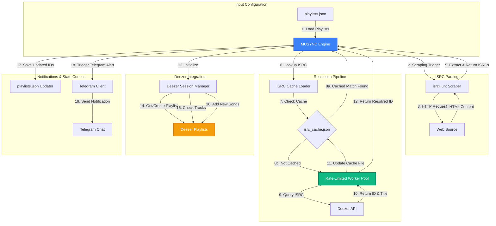

# MUSYNC

MUSYNC is an automated synchronization tool designed to mirror online music playlists (such as Spotify public shares) onto Deezer. Unlike simple title-based search scripts, MUSYNC queries track records globally by **ISRC (International Standard Recording Code)** to ensure exact matched recordings are synchronized.

It is structured to run as a fast, state-preserving executable—perfect for scheduled executions (cron jobs) on cloud platforms or continuous integration pipelines like GitHub Actions.

## Key Features

- **ISRC Resolution**: Synchronizes tracks using industry-standard ISRC codes to guarantee exact recording matches.
- **Concurrent Execution with Intelligent Throttling**: Utilizes Go's concurrency primitives with an active rate limiter capped at 9 requests per second to avoid triggering Deezer's quota limits.
- **State Preservation**: Saves resolved playlist IDs directly to a local configurations file (`playlists.json`).
- **Persistent Local Cache**: Maintains a local `isrc_cache.json` tracking resolved mappings of ISRC codes to Deezer IDs and track titles. Subsequent runs read from the cache first, resulting in zero API requests for already-resolved tracks.
- **Telegram Notification Integration**: Dispatches rich, colorized execution summaries (indicating elapsed duration, tracks processed/added, and error status) straight to a Telegram bot.
- **GitHub Actions Ready**: Fully configured workflow to run automatically every 4 hours, commit updated playlist IDs and the ISRC cache back to the repository, and send status updates.

## System Architecture

The following diagram illustrates how MUSYNC synchronizes track playlists from source web pages to Deezer.

